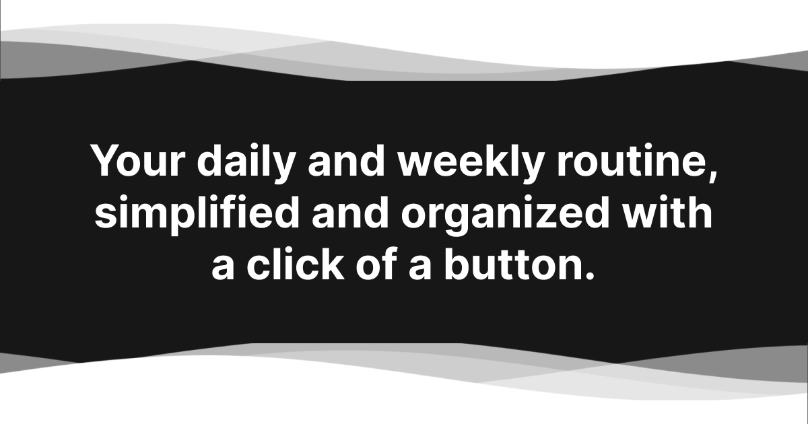

# Taskmaster

Visit at https://taskmaster-flame.vercel.app/

Meet Taskmaster: Your daily organizer reimagined. In the midst of daily routines and weekly commitments, having a reliable organizer is crucial. TaskMaster fills that gap, without overcomplicating things. Leveraging libraries like Next.js, Kinde Auth, React, TypeScript, Prisma, and TailwindCSS, it's robust and developer-friendly. Regardless of the device you're viewing it on, TaskMaster looks and feels intuitive. Plus, we've prioritized accessibility right from the start.

## Features
- Plan and keep tabs on daily to weekly commitments.
- Dive deeper with subtasks and intuitive progress trackers.
- Set up habits for recurring activities.
- Keep a close eye on the clock with timed tasks.
- Organize your tasks in custom lists.
- Looks crisp on devices of all sizes.
- Strong focus on accessibility: built for everyone.
- Powered by modern technologies for optimum performance.

## Installation
1. Clone the repository: `git clone https://github.com/Levan-D/taskmaster.git`
2. Install dependencies: `npm install`
3. Add your env variables for kinde auth and db of choice 
4. Start the app: `npm run dev`
5. Open `http://localhost:3000` in your browser

## Contributing
Got suggestions for TaskMaster? Or stumbled upon something that needs a tweak? Whether it's a feature idea, a bug catch, or code optimization, we value collaboration. Feel free to open an issue or submit a PR.

## License
TaskMaster is under the Apache-2.0 license — because open source is the way to go!
